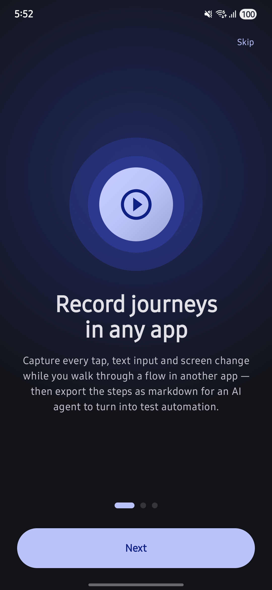
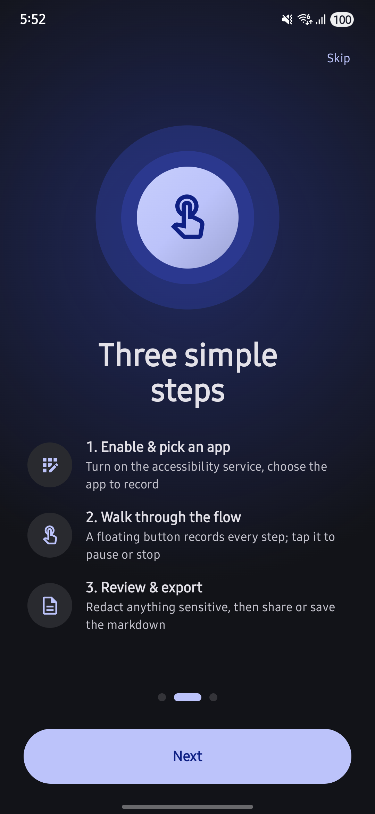
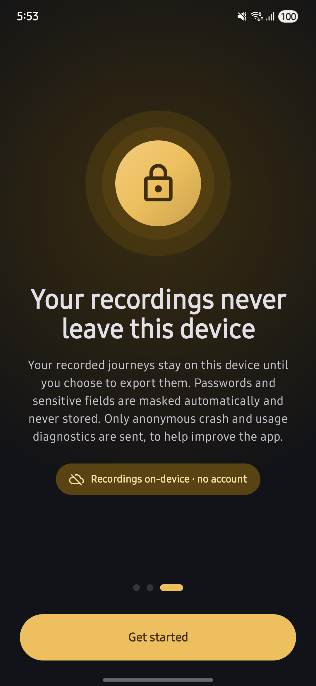
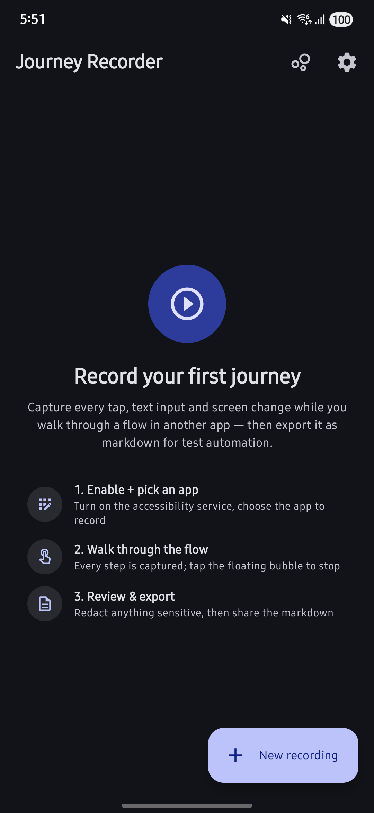
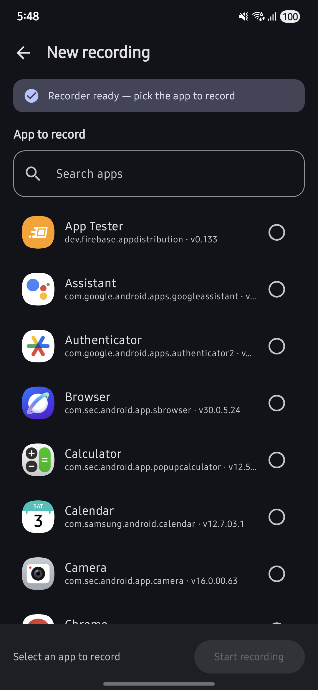
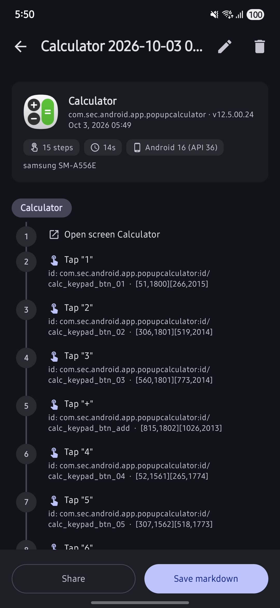

<div align="center">
  

  <h1>Journey Recorder</h1>

  <p>
    <strong>Record a user journey in any app. Export it as test-automation-ready Markdown.</strong><br>
    Taps · text input · screen changes — captured on-device, reviewed, redacted, exported
  </p>

  <p>
    
    
    
    
    
    
  </p>

  <a href="https://play.google.com/store/apps/details?id=com.ryccoatika.journeyrecorder">
    
  </a>
</div>

<p align="center">
  
</p>

A native Android SQA tool that records user journeys in **other** apps — taps, text input, screen changes — via an `AccessibilityService`. Journeys are reviewed in-app with per-value redaction, then exported as Markdown that a downstream AI agent turns into test automation (Maestro / Appium / Espresso). Everything stays on-device until you export.

## Screenshots

<p align="center">
  
  
  
</p>

<p align="center">
  
  
  
</p>

<p align="center"><em>Onboarding — record anything · three steps · on-device privacy<br>Journey list · Pick an app · Review &amp; export</em></p>

## Features

- **Capture in any app**: records clicks, long-presses, text input, scrolls, screen changes and system-dialog interactions in the target app you pick — driven by an `AccessibilityService`, no instrumentation of the target required.
- **Robust element identity**: a fallback locator chain (view id → content description → own text → descendant text → hint → class + bounds) keeps steps usable even on Compose / Flutter / React Native UIs that expose no view ids. Each step carries a confidence level, surfaced in the export.
- **Privacy-first masking**: passwords and sensitive fields (PIN, OTP, CVV, card numbers via Luhn) are masked in the capture pipeline **before** anything touches disk — raw sensitive text is never persisted. Masked rows store no stand-in value.
- **Review & redact**: every typed value is shown in the step list with a redact toggle before export. Review-before-export stays structural.
- **Markdown export**: numbered, screen-grouped steps with a header (app package/version, device, Android version). Share sheet on all APIs; Save to Downloads on API 29+.
- **Floating control bubble**: a draggable overlay to pause / stop / discard a recording, magnetic drag-to-trash with haptics, plus a live notification so you can stop even if the bubble is dismissed.
- **Crash-resilient recording**: if the recorder process is killed mid-recording, the journey survives and is marked *recovered* — captured steps are never lost.
- **On-device by design**: recorded journeys never leave the device. Only anonymous crash/usage diagnostics are sent (no journey content, no app identity).

## Architecture

Single Gradle module, layered packages, **manual DI** via a `Graph` singleton — no Hilt, on purpose. The capture engine is a set of small, single-responsibility pieces with the pure layers isolated for JVM testing.

```
recorder/   AccessibilityService capture engine: EventInterpreter, ElementIdentity,
            ScreenTracker, StepPipeline, SensitiveTextGuard, RecorderStateHolder, bubble/
data/       Room entities + DAO, JourneyRepository (sole writer of recorder state), prefs
export/     MarkdownGenerator (pure, golden-tested), ExportManager, notifier + action receiver
analytics/  AppAnalytics — Firebase wrapper (anonymous diagnostics)
ui/         Compose screens + ViewModels (Navigation-Compose, Material 3)
di/         Graph — manual DI singletons
```

Key decisions:

- **`AccessibilityNodeInfo` never leaves `EventInterpreter` / `ElementIdentity`.** Nodes are live IPC proxies that go stale and can throw. An immutable `RawCapture` is extracted synchronously on the callback thread; all node traversal is wrapped — a throw degrades to event-payload extraction with low confidence, never a service crash.
- **`StepPipeline` is a single-consumer channel.** One coroutine owns all mutable state (sequence counter, coalescers, dedup, masking) — no locks, deterministic order, JVM-testable. Every finalized step is written through to Room immediately.
- **`sequence` drives ordering, never timestamps.** Coalesced steps (typing, scrolls) emit late but sort by when they started; all queries and Markdown numbering follow `sequence`.
- **`JourneyRepository` is the sole writer of recorder state.** UI, bubble and service only observe.
- **No foreground service** — an enabled a11y service already holds the process at FGS importance.
- **Masking before persistence** (`SensitiveTextGuard`: password flags, name regex, Luhn; fail closed on unknown fields). Pure and unit-tested.
- Pure logic (`MarkdownGenerator`, `SensitiveTextGuard`, `StepPipeline`) is JVM-unit-tested; the pipeline value types carry no `android.*` imports so the suite runs on the JVM.

See [`docs/ARCHITECTURE.md`](docs/ARCHITECTURE.md) for the full contract (layers, dependency rules, invariants) and [`CONTRIBUTING.md`](CONTRIBUTING.md) to get started.

## Package map

| Package | Responsibility |
|---|---|
| `recorder` | `JourneyAccessibilityService` (event gate), `EventInterpreter`/`ElementIdentity` (all node access + locator chain), `ScreenTracker`, `StepPipeline`, `SensitiveTextGuard`, `RecorderStateHolder` |
| `recorder/bubble` | `BubbleController` — plain-View overlay: drag, pause/stop/discard fan, drag-to-trash |
| `data` | `JourneyRepository` (start/finish/rename/delete + orphan recovery), `AppPrefs` (DataStore) |
| `data/db` | Room: `JourneyEntity`, `JourneyEventEntity`, `EventType`, `JourneyDao`, migrations |
| `export` | `MarkdownGenerator` (pure), `ExportManager` (share + MediaStore Downloads), `JourneyNotifier`, `JourneyActionReceiver` |
| `analytics` | `AppAnalytics` — anonymous lifecycle/feature events + crash reporting |
| `ui/home` | Journey list: search, scroll-collapse, long-press multi-select delete, recording banner |
| `ui/setup` | Permission checklist + app picker + start recording |
| `ui/detail` | Step list with screen headers, per-value redaction, share / save |
| `ui/settings` · `ui/guide` · `ui/onboarding` | Theme + replay intro, framework ID guide, first-run pager |

## Build & run

```bash
./gradlew compileDebugKotlin   # fast compile check
./gradlew test                 # JVM unit tests
./gradlew assembleDebug        # debug APK
./gradlew assembleRelease      # signed release APK (needs the release key)
```

Requires JDK 17+, Android SDK 36. minSdk 24 (Android 7.0), targetSdk 36.

Firebase is mandatory. `app/google-services.json` is gitignored — decrypt it first (only the encrypted `release/*.gpg` blobs are committed):

```bash
ENCRYPT_KEY=<passphrase> ./release/decrypt-secrets.sh
```

Install on a device with `adb install -r app/build/outputs/apk/debug/app-debug.apk`. On Android 13+ the accessibility toggle is greyed out ("Restricted setting") for browser/file-manager installs — `adb install` is exempt.

## Device & capture caveats

- **Compose / Flutter / React Native targets expose no view ids** — steps fall back to text / content-description / bounds locators, flagged in the export. The in-app Guide documents this per framework.
- **Android 13+ restricted setting**: sideloaded apps can't be enabled from Settings unless allowed; `adb install` avoids the block.
- **Accessibility-blocking apps** (some banking apps) deliberately suppress the accessibility tree and can't be recorded.
- **Gestures**: swipes, pinch and drag are not captured — only taps, typing and scrolls.
- **Process death**: battery managers can kill the recorder; the journey is kept and marked *recovered* rather than lost.
- **Split-screen** is unsupported.

## License

Released under the [MIT License](LICENSE) — © 2026 Rycco Atika.
